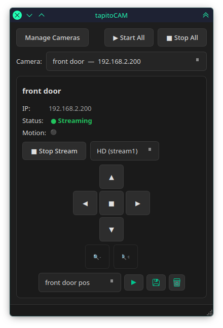

# tapitoCAM

TP-Link Tapo Camera RTSP Client for Linux — multi-camera control center.




## Recent Changes

- **Major refactoring**: Simplified camera configuration with improved IP validation using `ipaddress` module
- **Migration cleanup**: Removed legacy `.tapitocam.env` file migration code
- **Code cleanup**: Streamlined validation and password handling
- **Test updates**: Refactored test files to match new implementation

See git history for full details.

## Features

- Multi-camera support — any number of Tapo cameras
- Standalone mpv streaming — one window per camera (Wayland-friendly)
- Full PTZ — pan, tilt, zoom, presets via ONVIF
- HD / SD quality per camera
- OS keyring password storage
- CLI viewer with quality selection

## Install

```bash
curl -fsSL https://raw.githubusercontent.com/dressedinblack5/tapitoCAM/main/install.sh | bash
```

Or clone and install manually:

```bash
git clone https://github.com/dressedinblack5/tapitoCAM.git
cd tapitoCAM
./install.sh
```

Requires: `mpv`, `ffmpeg`, `python3`, `pyside6`, `onvif-zeep`, `requests`, `lxml`. Optional: `keyring`.

Or run without installing: `./tapitocam_gui.py` (GUI) / `./tapitocam.sh` (CLI).

### Camera Setup

Create a **Camera Account** in the Tapo app: gear → Advanced Settings → Camera Account.

#### Authentication

Newer Tapo firmware rejects camera account credentials for the management API
(port 443). **Enable *Third Party Compatibility*** in the Tapo app:
Tapo App → Me → Third‑Party Compatibility → On.

## Usage

### PTZ Controls

```
         ▲              Pan / Tilt — hold to move
      ◀  ■  ▶           Stop       — click ■
         ▼              Zoom       — hold 🔍+ or 🔍-
       🔍-  🔍+

  [Preset ▼]  ▶  💾  🗑            Recall / Save / Delete
```

Controls lock until streaming. PTZ connects async (1–3s), UI stays responsive.

Presets are stored on the camera and cached locally. Each camera's presets
are isolated. Saving a preset prompts for a name.

### Camera Controls (pytapo)

Night mode and LED indicator are controlled via the `pytapo` library.

```
Night: [Auto] [IR] [Light]  │  LED: [● On]
```

- **Night**: Auto (on‑demand), IR (always infrared), Light (white LED flood)
- **LED**: Toggle the camera's blue status LED on/off

Each tap runs in a background thread — the UI stays responsive, and if a
command fails the button reverts to its previous state.

#### Compatible Devices

Users have reported pytapo working with these TP-Link Tapo cameras:

| Series | Models |
|--------|--------|
| C Series | C100, C110, C120, C200, C201, C210, C211, C216, C220, C225, C236, C310, C320WS, C402, C403, C410, C420, C420S2, C425, C500, C510W, C520WS, C530WS, C710, C720 |
| TC Series | TC55, TC60, TC70, TC72NL/EU, TC82, TC85 |
| D Series (Doorbell) | D100C, D130, D205, D230, D235 |

The library *should* work with any other Tapo camera exposing the HTTPS
management API. If you have success with an unlisted model, please open
an issue.

> Note: Battery/solar‑powered devices may not expose ONVIF or RTSP,
> but pytapo management API (night mode, LED) should still work.

### CLI

```
tapitocam -i 192.168.1.100
tapitocam -c 1 -q sd
tapitocam --list
```

## Security

Credentials are stored in the OS keyring (fallback: base64 `0o600` JSON).
The RTSP URL is never exposed on the command line — passed to mpv via `--playlist`.
Error messages are sanitized before display.

**Known:** ONVIF uses HTTP (no TLS). CLI writes RTSP URL to temp file briefly.

## Uninstall

```bash
rm -f ~/.local/bin/tapitocam ~/.local/bin/tapitocam-gui \
      ~/.local/bin/tapitocam-cli-helper \
      ~/.local/bin/cameraconfig.py ~/.local/bin/cameradialog.py \
      ~/.local/bin/cameratile.py ~/.local/bin/styles.py ~/.local/bin/utils.py \
      ~/.local/share/applications/tapitoCAM.desktop
rm -rf ~/.config/tapitocam
```
