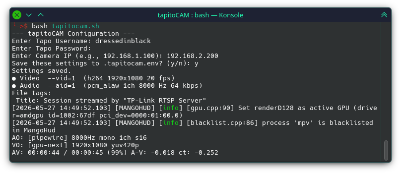
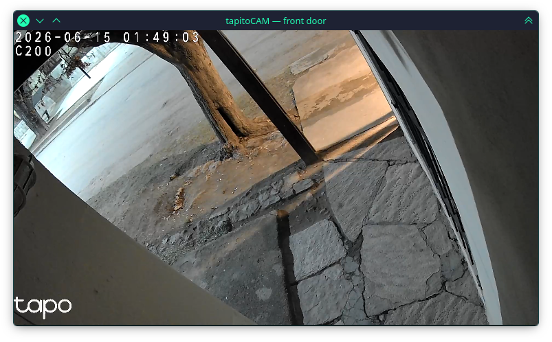

# tapitoCAM

TP-Link Tapo Camera RTSP Client for Linux.




## Prerequisites

- **RTSP-compatible Tapo camera** (e.g., C200, C310, C320WS)
- **mpv** — video player (`apt install mpv`)
- **Python 3.10+ and PySide6** (for GUI):
  ```bash
  pip install pyside6 python-mpv onvif-zeep
  ```

You also need to create a dedicated **Camera Account** in the Tapo app for RTSP access:

1. Open the Tapo app and select your camera.
2. Tap the gear icon → **Advanced Settings** → **Camera Account**.
3. Create a username and password (separate from your main TP-Link account).
4. Use these credentials with tapitoCAM to connect via the camera's local IP.

## Quick install

```bash
git clone https://github.com/dressedinblack5/tapitoCAM.git
cd tapitoCAM
./install.sh
```

This installs `tapitocam` (CLI) and `tapitocam-gui` to `~/.local/bin/` and
registers the desktop app.  Add `~/.local/bin` to your `PATH` if needed:

```bash
export PATH="$HOME/.local/bin:$PATH"
```

## Run without installing

```bash
git clone https://github.com/dressedinblack5/tapitoCAM.git
cd tapitoCAM
./tapitocam.sh       # CLI
./tapitocam_gui.py   # GUI
```

## First run

On first launch you'll be prompted for your Tapo camera username, password,
and local IP address.  Credentials are saved to
`~/.config/tapitocam/.tapitocam.env` (permissions `600`).

### CLI Options

```
Usage: tapitocam.sh [OPTIONS]

  -h, --help       Show this help message
  -r, --reset      Reset saved configuration
  -i, --ip IP      Set camera IP address (overrides saved config)
```

Examples:
```bash
tapitocam -i 192.168.1.100
tapitocam --reset
```

## Uninstall

```bash
rm -f ~/.local/bin/tapitocam ~/.local/bin/tapitocam-gui \
      ~/.local/share/applications/tapitoCAM.desktop
rm -rf ~/.config/tapitocam
```

## Notes

- Username and password are URL-encoded automatically to handle special characters.
- IP addresses are validated (each octet 0-255).
- Temporary mpv logs are cleaned up automatically on exit.
- The GUI supports PTZ (pan/tilt/zoom) control via ONVIF and stream quality selection.
- Use `stream1` for HD and `stream2` for SD (useful on slow networks).
